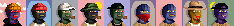
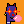
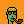
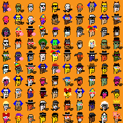

# Artbase Sandbox (& Cache) Vol. 3 - Quick & Dirty "One-Off" Scripts To Download Complete Collections


## What's News?

### February 2023

**24×24 Unordinal Punks** (max. 1000) <br>


### December 2022

**48×48 Kawaii Kittens** (max. 1700) <br>
  <br>
[**kawaiikittens.png**](https://github.com/pixelartexchange/collections/blob/master/kawaiikittens/kawaiikittens-48x48.png)  (~1.27MB)


**26×26 Blklavas** (max. 5090) <br>



## Yes, You Can  - Download (& Analyze / Archive) Your Own Pixel Art Collections  - A Step-By-Step Guide


If you are new to the [**artbase**](https://github.com/pixelartexchange/artbase) machinery, here's an up-to-date (anno 2023) follow-along step-by-step guide.

Let's try the 1000 Unordinal Punks (24×24) collection - FREE MINTING NOW!


### Step 1   -  Add An Artbase Collection Configuration (collection.yml)


For now the required fields in the artbase collection configuration include `slug`, `count`, `token_base`, `format` & `source` - see [unordinalpunks/collection.yml](unordinalpunks/collection.yml):


``` yaml
slug:       unordinalpunks
count:      1000
token_base: https://app.bueno.art/api/contract/DMJiB_27eF50gizS36MMN/chain/1/metadata/{id}
format:     24x24
source:     2400x2400
offset:     1
```

`slug` - slug is the "slugified" artbase project diretory name e.g. unordinalpunks for  "Unordinal Punks" or is the official unofficial name "Un(official) Ordinal Punks"? ;-)

`count` - is the max. number of collection items e.g. 1000 max.

`token_base` - is the "magic" web link formula / template for getting the "off-chain" token meta data - where `id` is a placeholder for the token id (running from 1 to 1000)

`format` - is the pixel art (minimal) dimension size e.g. 24x24 px and

`source`  - is the pixel art dimension size e.g. 2400x2400px, that is, 100x (!) of the official "original" token image download

`offset`  - is the first collection id / offset (optional if starting at 0) and use 1 for starting counting at 1


Aside - Now you might wonder - how to find out the "magic" token base link formula /template
for a collection?

Lookup the collection contract address and
than go the etherscan.io blockchain explorer.
For example,  for Unordinal Punks
the contract address is 0x05bbb2bf0a41393e61d3edc18b979cbcb55ab48d
and, thus, the [etherscan page @ 0x05bbb2bf0a41393e61d3edc18b979cbcb55ab48d](https://etherscan.io/address/0x05bbb2bf0a41393e61d3edc18b979cbcb55ab48d).

Next click on the "Contract" tab and the "Read Contract" (sub)tab
and look for the "tokenURI" (contract) method /service.
Enter the tokenId (uint256), that is, 1 (not 0) as the first id
and hit "Query" resulting in the "magic" (off-chain) token base link forumla:

```
https://app.bueno.art/api/contract/DMJiB_27eF50gizS36MMN/chain/1/metadata/1
```

Try token ids - 2,3,4,etc.  resulting in:

```
https://app.bueno.art/api/contract/DMJiB_27eF50gizS36MMN/chain/1/metadata/2
https://app.bueno.art/api/contract/DMJiB_27eF50gizS36MMN/chain/1/metadata/3
https://app.bueno.art/api/contract/DMJiB_27eF50gizS36MMN/chain/1/metadata/4
...
```


### Step 2   -  Download the Collection Token Meta Data One-By-One

Now let's download the token metadata one-by-one:

```
$ artbase unordinalpunks meta
```

resulting in:

```
/unordinalpunks
   /token
      1.json
      2.json
      3.json
      4.json
      ...
```

If you look into  `1.json`
it's pretty minimal  (e.g. no attributes - only a link to an image):

``` json
{
  "attributes": [],
  "description": "",
  "image": "https://assets.bueno.art/images/548d10ad-f3f4-4d56-99c8-93c6c86813b4/default/1?s=e2494fa02198fc5c8ac972439ddded56",
  "name": "Unordinal Punk #1"
}
```


### Step 3   -  Download the Collection Images Via The Token Meta Data One-By-One

Now let's download the images (referenced in the token metadata) one-by-one:

```
$ artbase unordinalpunks img
```

resulting in:

```
/unordinalpunks
   /token-i
      1.png
      2.png
      3.png
      4.png
      ...
```


### Step 4   -  Downsample / Pixelate  the Collection Images One-By-One

If you look at the
pixel art image
the size is  2400x2400 px, that is, a 100x (!) zoom factor
if you assume a (minimal) 24x24 format.


Now let's downsample / pixelate the images one-by-one from
2400x2400 to 24x24px:

```
$ artbase unordinalpunks px
```

resulting in:

```
/unordinalpunks
   /24x24
      1.png
      2.png
      3.png
      4.png
      ...
```




 ...


Voila!  Now you have a backup or archive of the complete
pixel art collection with the token meta dataset
and all images "restored" to its original (minimal) size.


### Bonus: Step 5   -  Make A Teaser / Preview Strip  And An All-In-One Composite


Now for fun let's make a teaser or "preview" strip (of the first nine images):

```
$ artbase unordinalpunks strip
```

resulting in:

```
 /unordinalpunks
    /tmp
       unordinalpunks-strip.png
```


Or let's make an all-in-one "collect'em all" composite image -
note - the collection is still minting (thus, let's use the first hundred):


```
$ artbase unordinalpunks composite --limit=100
```

resulting in:

```
 /unordinalpunks
    /tmp
       unordinalpunks-24x24.png
```




That's it.


## Questions? Comments?


Post them on the [D.I.Y. Punk (Pixel) Art reddit](https://old.reddit.com/r/DIYPunkArt). Thanks.

